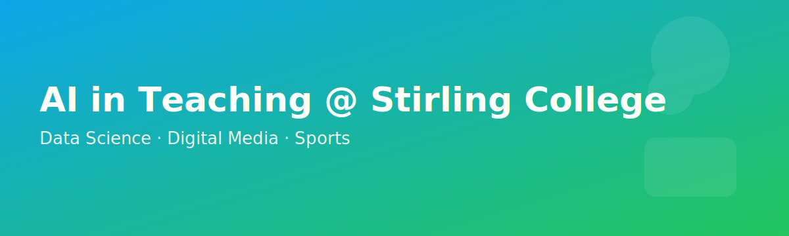

# AI in Teaching @ Stirling College (Chengdu University)
**Majors focus:** Data Science · Digital Media · Sports

A practical, step-by-step guide to help teachers use AI responsibly and effectively in **all three Stirling College majors**. Everything is organized with concrete, copy-paste examples, prompts, and assignments tailored to **Data Science**, **Digital Media**, and **Sports** (analytics, coaching & management).

---

## Quick Start

1) **Pick one main assistant** you’ll use this term  
   Recommended: [ChatGPT](https://chat.openai.com/) · [Claude](https://claude.ai/) · [Gemini](https://gemini.google.com/) · [Perplexity](https://www.perplexity.ai/)

2) **Publish a short Class AI Use Agreement** (template below)  
   Clarify where AI is **allowed / limited / not allowed**, how to **acknowledge AI**, and privacy basics.

3) **Pilot one AI-supported lesson** this week (Module 4)  
   Use AI for ideation, materials, and differentiation - then **verify** and **cite** sources.

> **Stirling alignment:** Focus on academic integrity, transparency about AI use, and process evidence-detectors are unreliable; use oral checks and artefacts instead.

---

## Contents

- [Module 1 - Responsible, Human-Centred AI Use](#module-1--responsible-humancentred-ai-use)  
- [Module 2 - Choose & Configure Your Assistant](#module-2--choose--configure-your-assistant)  
- [Module 3 - Prompting Patterns (Cheatsheet + Library)](#module-3--prompting-patterns-cheatsheet--library)  
- [Module 4 - Lesson Planning (Workflow + Examples)](#module-4--lesson-planning-workflow--examples)  
- [Module 5 - Assessment, Integrity & AI Levels](#module-5--assessment-integrity--ai-levels)  
- [Module 6 - Accessibility & Inclusive Design](#module-6--accessibility--inclusive-design)  
- [Module 7 - Data Privacy & Risk (per major)](#module-7--data-privacy--risk-per-major)  
- [Module 8 - Custom Course Assistant ](#module-8--custom-course-assistant-optional)  
- [Tools by Major](#tools-by-major)  
- [Assignments by Major (Templates)](#assignments-by-major-templates)  
- [Capstone Ideas by Major](#capstone-ideas-by-major)  
- [Policy Templates & Examples](#policy-templates--examples)  
- [AI Tool Adoption Rubric](#ai-tool-adoption-rubric)  
- [Implementation Timeline (Faculty PD)](#implementation-timeline-faculty-pd)  
- [Custom GPT Instruction Template](#custom-gpt-instruction-template)  
- [Acknowledging AI Assistance](#acknowledging-ai-assistance)  
- [FAQ](#faq)  
- [Contributing & License](#contributing--license)  
- [References](#references)

---

## Module 1 - Responsible, Human-Centred AI Use

**Principles**
- Keep **human agency** central; AI assists learning but does not replace it.
- Provide **opt-outs** and alternative human paths for any AI-enabled activity.
- Be transparent about **capabilities, limits, bias, and verification**.
- Do **not** upload personal or student-identifiable data into public tools.
- **Policy note (Stirling):** Set expectations by assignment; require students to **acknowledge AI use** and submit **process evidence** where AI is allowed.

**Class AI Use Agreement (Syllabus snippet - copy/adapt)**  
> **Purpose**: AI supports brainstorming, drafting, practice, and feedback; it does **not** replace critical thinking or original work.  
> **Allowed**: ideation, outlines, feedback on clarity, language refinement; tool-based practice (see major-specific allowances below).  
> **Limited**: summarising sources *with citations*; code or design suggestions that require human review.  
> **Not allowed**: final graded work written by AI; uploading assessment briefs or student PII to public tools.  
> **Credit**: Include an “AI Assistance” note in submissions.  
> **Equity**: Non-AI routes are available for every required task.  
> **Review**: Policy will be revisited mid-semester.

---

## Module 2 - Choose & Configure Your Assistant

Pick one: [ChatGPT](https://chat.openai.com/), [Claude](https://claude.ai/), [Gemini](https://gemini.google.com/), or [Perplexity](https://www.perplexity.ai/). Then configure it:

- Set **audience/level** (“first-year”, “capstone”), **format defaults** (tables, bullet lists), and **tone**.  
- Add a **profile prompt** that states your course context, output format, and a requirement for **sources + limitations note** in teacher outputs.  
- For technical courses, enable **code-friendly** responses (markdown code blocks). For digital media, allow **style constraints**. For sports, request **ethics/privacy reminders**.

**Profile prompt (copy-edit)**
```
You are a teaching assistant for [course] in the [Data Science / Digital Media / Sports] major at Stirling College (Chengdu University).
Default outputs: clear headings, bullet points, tables when useful. Provide sources/links for factual claims and a brief "limitations & bias" note for teacher-facing material.
Never request or process PII. Offer differentiated outputs (basic/standard/challenge). When generating code or design prompts, add a verification checklist.
```

---

## Module 3 - Prompting Patterns (Cheatsheet + Library)

**Prompt Skeleton**
```
Role: You are a [subject] lecturer helping [level] students at Stirling College.
Task: [create X], aligned to [module outcomes].
Audience/Tone: [plain, accessible, bilingual if needed].
Constraints: [time limit, word count, sources to cite, local examples].
Non-goals: [what to avoid].
Quality checks: [fact-check, add limitations/bias note].
Output format: [markdown/slide outline/table/code block/storyboard].
```

**Reusable techniques**
- **Few-shot style** (paste a short example to copy voice/format)  
- **Generate-facts → Answer** (facts list first, then response)  
- **Critique & improve** (ask for a critique pass, then revision)  
- **Self-consistency** (ask for 3 variants, then a final merged version)

**Prompt Library (general)**
1) *90-min lesson outline*  
```
Create a 90-minute lesson on [topic] aligned to [outcomes] with timings, activities, checks for understanding, materials, and an exit ticket.
Differentiate tasks (basic/standard/challenge). Provide sources and a short "limitations & bias" note for teachers.
```
2) *Socratic questions*  
```
Make 10 Socratic questions leading students from intuition to formal reasoning about [concept]. Include common misconceptions.
```
3) *Quiz + rationales*  
```
6-question mixed quiz (MCQ + short answer) on [topic] with answer key, 1-sentence rationales, and Bloom's tags.
```

---

## Module 4 - Lesson Planning (Workflow + Examples)

**Outcome-first workflow (≈60 minutes)**
1) Paste outcomes + week topic → ask for an active learning plan with checks for understanding.  
2) Generate materials: slides outline, short reading, exit ticket.  
3) Differentiate: create basic/standard/challenge variants and a multilingual glossary.  
4) Verification pass: require links; manually spot-check and adapt to local context.

### Examples by Major

**Data Science - Week 4: Supervised Learning & Overfitting**  
- *Activities*: mini-lab fitting a small model, **error analysis walk-through**, and a **hold-out vs. CV** comparison.  
- *Materials*: 300/600-word reading on bias-variance with 10-term glossary.  
- *Exit ticket*: 3 items on leakage, validation strategy, and metric trade-offs.

**Digital Media - Week 5: Storyboarding for Short-Form Video**  
- *Activities*: group storyboard challenge with **shot list templates**, AI-generated alternative angles, and peer critique rubric.  
- *Materials*: mood boards and script beat-sheet; accessibility note (captions/alt text).  
- *Exit ticket*: upload storyboard + 100-word creative rationale.

**Sports - Week 3: Intro to Performance Analytics**  
- *Activities*: small data exploration of match events; **KPIs vs. context** discussion; practice creating a **shot map** or **sprint profile**.  
- *Materials*: glossary (EN/中文) for common metrics; privacy/ethics mini-brief.  
- *Exit ticket*: pick one KPI, justify why it is **valid** and **actionable** for a coach.

---

## Module 5 - Assessment, Integrity & AI Levels

**AI Levels (set per assignment)**
1) **No AI** - closed-book quizzes, in-class derivations/orals.  
2) **AI limited** - outlines/brainstorming allowed; final text/code/design is student-authored.  
3) **AI permitted** - drafting with AI allowed; submit **process evidence** (prompts, outputs, change log).  
4) **AI partner** - co-creation; grade prompt quality, verification, and reflection.  
5) **AI toolchain** - complex projects; grade planning, tool orchestration, and decisions.

**Integrity without detectors**
- Collect **process artifacts** (drafts, prompt history, version diffs).  
- Use **micro-vivas** (1–3 minutes) to confirm understanding.  
- Localise tasks (datasets, assets, campus context) to reduce generic outputs.

---

## Module 6 — Accessibility & Inclusive Design

- Generate bilingual glossaries, plain-language versions, and reading/listening alternatives.  
- Ask AI to draft **alt text**, **captions**, and **transcripts** (then review).  
- Offer multiple means of action/expression: code, essay, presentation, prototype.

**Alt-Text Prompt**
```
Write concise alt text (≤125 chars) for an image of [describe]. Include the learning focus (what students should notice).
```

---

## Module 7 - Data Privacy & Risk (per major)

> **Minimums:** Prefer privacy-preserving workflows, clear consent, and **opt-out** paths. For higher-risk uses, pilot small and monitor.

**Data Science**  
- Never upload raw datasets containing PII to public tools.  
- Prevent **data leakage** (train/test contamination) when co-creating with AI.  
- Document sources; avoid fabricated citations; verify statistics.

**Digital Media**  
- Respect **copyright & licenses** (assets, fonts, models).  
- Disclose synthetic media use; avoid deepfake likenesses without consent.  
- Provide accessible outputs (captions, transcripts, colour-contrast).

**Sports**  
- Athlete data is **sensitive**: anonymise, aggregate, or use public/open data.  
- Do not publish identifiable performance/health data without consent.  
- Consider context: metrics should inform coaching decisions, not stigmatise athletes.

---

## Module 8 - Custom Course Assistant (Optional)

- Upload materials you **own** or can share: syllabus, outcomes, rubrics, exemplar answers (teacher-only), misconceptions, bilingual glossary.  
- Keep it **private**; disclose to students; always provide a **non-AI alternative**.

**Seed instruction add-ons by major**  
- *Data Science*: prefer **explainable baselines** before advanced models; include **evaluation checklists**.  
- *Digital Media*: enforce **attribution rules**; add a “style constraints & originality” reminder.  
- *Sports*: add **ethics prompts** and **data-minimisation** defaults.

---

## Tools by Major

**Common chat & research**  
- [ChatGPT](https://chat.openai.com/) · [Claude](https://claude.ai/) · [Gemini](https://gemini.google.com/) · [Perplexity](https://www.perplexity.ai/)  
- [Elicit](https://elicit.org/) (paper discovery) · [NotebookLM](https://notebooklm.google/) (source-grounded notes)  
- [Canva](https://www.canva.com/) (quick visuals)

**Data Science** (teaching-friendly)  
- **[Python](https://www.python.org/)**: Jupyter/Colab, [pandas](https://pandas.pydata.org/), [numpy](https://numpy.org/), [scikit-learn](https://scikit-learn.org/), matplotlib/plotly  
- **DL**: PyTorch/TensorFlow (intro labs), [Keras](https://keras.io/)  
- **Data**: [Kaggle Datasets](https://www.kaggle.com/datasets), [UCI ML Repository](https://archive.ics.uci.edu/)  
- **MLOps (lightweight)**: [DVC](https://dvc.org/), [Weights & Biases](https://wandb.ai/) (education tiers)  
- **Visualization**: [Tableau Public](https://public.tableau.com/) / [Power BI Desktop](https://www.microsoft.com/power-platform/products/power-bi/desktop) / [Plotly](https://plotly.com/python/)

**Digital Media**  
- **Design**: [Canva](https://www.canva.com/), [Figma](https://www.figma.com/) (education), Adobe Express/Firefly (check licenses)  
- **3D/Animation**: [Blender](https://www.blender.org/)  
- **Video**: [DaVinci Resolve](https://www.blackmagicdesign.com/products/davinciresolve), [CapCut](https://www.capcut.com/) (education)  
- **Audio**: [Audacity](https://www.audacityteam.org/), [Ocenaudio](https://www.ocenaudio.com/)  
- **Image gen**: [DALL·E](https://openai.com/research/dall-e), [Midjourney](https://www.midjourney.com/) (use ethically; disclose)

**Sports**  
- **Analysis**: [Tableau Public](https://public.tableau.com/), [Power BI](https://powerbi.microsoft.com/), [Python](https://www.python.org/) ([pandas](https://pandas.pydata.org/), [numpy](https://numpy.org/)), [R](https://www.r-project.org/) ([tidyverse](https://www.tidyverse.org/))  
- **Video tagging**: [LongoMatch](https://www.longomatch.com/), [Kinovea](https://www.kinovea.org/) (motion review)  
- **Open data**: [StatsBomb open data](https://statsbomb.com/resources/), [FiveThirtyEight](https://fivethirtyeight.com/) archives (for teaching)  
- **Pose/vision (advanced)**: OpenPose/MediaPipe (for labs with consented, public videos)

> Always check institutional approvals and licenses before using external tools with students.

---

## Assignments by Major (Templates)

### Data Science

**A1: Model-Building with Process Evidence (Level 3)**  
- Deliverables: notebook with EDA → baseline → tuned model; **change log**; 200-word reflection on trade-offs.  
- Integrity: submit prompts/outputs if AI helped; micro-viva (2 minutes).  
- Rubric: problem framing, data handling, evaluation validity, reasoning, reflection.

**A2: Responsible AI Card (Level 2–3)**  
- Students create a **model card** for a small classifier (task, data, metrics, risks, intended uses/misuses).  
- Include fairness checks (subgroup errors) on synthetic subsets.

**A3: Reproducible Mini-Challenge (Level 4–5)**  
- Team builds a small pipeline ([DVC](https://dvc.org/) or saved notebooks) on a public dataset; includes README + run steps; bonus for CI checks.

**Starter prompts**  
```
Suggest three strong baseline models for [dataset description], with a plan to compare validation strategies (hold-out vs k-fold). Provide a checklist to avoid data leakage.
```
```
Critique this confusion matrix and propose two concrete ways to improve recall without collapsing precision. Explain the trade-offs.
```

### Digital Media

**A1: Storyboard + Shot List (Level 2–3)**  
- Deliverables: storyboard (8–12 frames), beat sheet, 60-sec video plan, accessibility plan (captions/alt text).  
- Integrity: AI may suggest camera angles; student must justify choices and originality.

**A2: Brand Style Guide (Level 3)**  
- Create a 1-page style guide (typography, palette, imagery rules) for a campus club; include licensing notes and alt-text patterns.

**A3: Short Video Prototype (Level 3–4)**  
- 30–60s edit with captions and credits; submit process files and a 150-word reflection on **ethical use of AI assets**.

**Starter prompts**  
```
Generate three alternative storyboard approaches for a 60-second video promoting [topic]. For each, include key shots, framing, transition ideas, and a risk note about overuse of synthetic assets.
```
```
Draft alt text and caption templates for a motion-graphics video that highlights [concept]. Include a checklist for accessibility.
```

### Sports (Analytics, Coaching & Management)

**A1: KPI Brief for a Coach (Level 2–3)**  
- Pick a team sport; define 3 KPIs, how to **measure**, **contextualise**, and **act** on them.  
- Include ethical/privacy considerations and communication for athletes.

**A2: Match/Session Analysis Notebook (Level 3)**  
- Use public match events or GPS-like synthetic data to build a small dashboard (possession, shot quality, sprints).  
- Submit code, visuals, and 200-word coaching recommendations.

**A3: Recruitment/Scouting Report (Level 3–4)**  
- Compare two players with role-appropriate metrics; justify validity; add a **limitations** section.

**Starter prompts**  
```
Given [sport] match event data, generate three coach-facing visualisations (titles + rationale) that are actionable within a 5-minute halftime briefing.
```
```
Propose an ethics checklist for collecting and analysing athlete performance data in a university setting. Include minimisation and consent.
```

---

## Capstone Ideas by Major

**Data Science**
1) **Campus Energy Forecasting** - time-series models for building energy; optimisation suggestions with uncertainty ranges.  
2) **Student Support Early Signals** - privacy-preserving risk flagging with explainable baselines; fairness checks.

**Digital Media**
1) **Interactive Museum Guide** - multilingual micro-stories and AR wayfinding prototypes; accessibility by design.  
2) **Local Business Creative Suite** - brand system + templates + short-form content pack; licensing audit.

**Sports**
1) **Performance Insights Toolkit** - open-data dashboards (shot maps, press intensity) with coach-friendly briefs.  
2) **Injury-Risk Communication Guide** - literature synthesis + prototype of **non-stigmatizing** decision aids for staff.

---

## Policy Templates & Examples

### Syllabus AI Use Statement (copy/adapt)

- **Allowed**: brainstorming, outlines, language refinement; discipline-specific suggestions (see majors).  
- **Limited**: summarising sources with references; design/code suggestions (human review required).  
- **Not allowed**: final graded work produced by AI.  
- **Privacy**: no PII/student work in public tools; use approved platforms only.  
- **Acknowledgement**: include an “AI Assistance” note in submissions.  
- **Opt-out**: human alternatives for any required AI feature.  
- **Stirling note**: Reference your school/department’s current AI guidance in assessment briefs.

### By-Assignment Examples
- **Reading response**: AI for outline/clarify; student writes final; attach outline + reflection.  
- **Lab report**: AI for formatting/grammar; analysis and interpretation are student-authored.  
- **Oral viva**: AI may generate practice questions; in-person assessment is AI-free.

---

## AI Tool Adoption Rubric

Score candidate tools (1–5):
1) **Accuracy & Learning Value**  
2) **Transparency** (limitations, sources)  
3) **Privacy & Data Minimisation**  
4) **Accessibility/UDL**  
5) **Equity & Inclusion**  
6) **Opt-out Availability** (human alternative)

**Example (filled)**  
| Criterion | Score | Evidence/Notes |
|---|:--:|---|
| Accuracy & Learning Value | 4 | Good alignment; teacher review needed |
| Transparency | 3 | Links present, but generic |
| Privacy & Minimisation | 4 | Student accounts not required |
| Accessibility/UDL | 3 | Works on mobile; test with screen readers |
| Equity & Inclusion | 4 | Multilingual features |
| Opt-out Availability | 5 | Full human path available |

---

## Custom GPT Instruction Template

Paste into your assistant’s “system/instructions”:
```
You are a course assistant for [Course Name] at Stirling College (Chengdu University).
Goals: Support [level] students to meet [learning outcomes].
Do:
- Use plain language; scaffold explanations; offer structured outlines, examples, and checklists.
- Ask one clarifying question only if essential to meet the request.
- Provide sources/links for factual claims; flag uncertainty and common misconceptions.
- Offer differentiated outputs (basic/standard/challenge).
- Respect privacy: never request or process PII or student-identifiable work.
- Include a short “limitations & bias check” note for teacher-facing outputs.

Don’t:
- Produce final graded work or complete summative assessments.
- Fabricate citations or statistics; if unsure, say so and propose verification.
- Store or reuse any user content beyond the current session.

Formatting defaults:
- Use markdown with headings, bullet points, and tables when helpful.
- For Data Science: prefer simple, explainable baselines before advanced models; include evaluation checklists.
- For Digital Media: enforce attribution/licensing and originality reminders; add accessibility notes.
- For Sports: emphasise data minimisation, consent, and coach-facing clarity.
```

---

## Acknowledging AI Assistance
> “**AI Assistance**: [Tool] used for brainstorming structure and producing draft prompts. All outputs were reviewed, sources verified, and revised by the author.”

---


## Rubrics (Download & Adapt)

- **Data Science**: [CSV](/mnt/data/rubric_data_science.csv) · [Markdown](/mnt/data/rubric_data_science.md)  
- **Digital Media**: [CSV](/mnt/data/rubric_digital_media.csv) · [Markdown](/mnt/data/rubric_digital_media.md)  
- **Sports**: [CSV](/mnt/data/rubric_sports.csv) · [Markdown](/mnt/data/rubric_sports.md)


---

## References
- **UNESCO** — *Guidance for Generative AI in Education & Research* (human-centred, inclusion, equity).  
- **U.S. Dept. of Education (Office of EdTech)** — *Empowering Education Leaders: A Toolkit for Safe, Ethical, and Equitable AI Integration* (privacy, civil rights, opt-outs).  
- **Stirling (internal policy summary)** — *AI in Teaching & Assessments Workshop (Autumn 2024)* — staff/student guidance highlights on assessment and disclosure.  
- **Stirling College / Data Science** — *Programme Handbook (2023–2024)* — assessment & integrity context for DS modules.  
- **Teachers’ prompting & critical use** — *Ways to Use AI Critically in the Classroom* — prompt-building, bias checks.

